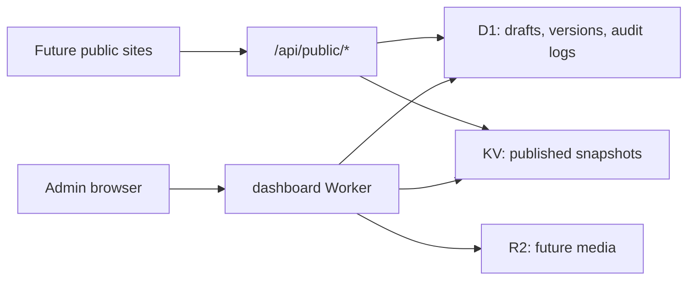
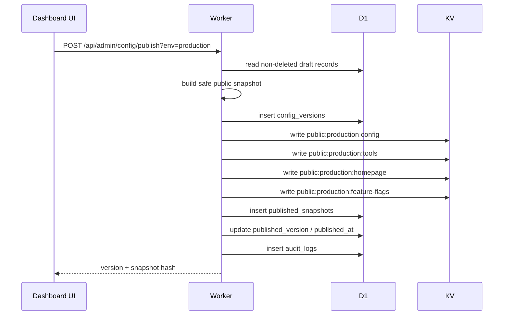

# dashboard-voxwind Architecture

`dashboard-voxwind` is the future central operating system for the VoxWind ecosystem. It is currently isolated from all existing public apps and Workers.

## Core Contract

The architecture is intentionally Cloudflare-native:

```text
Dashboard UI
  -> Worker Admin API
  -> D1 source of truth
  -> publish snapshot
  -> KV runtime cache
  -> Public config APIs
```

- D1 is the source of truth.
- KV stores environment-scoped published runtime snapshots.
- R2 is reserved for media storage.
- Workers enforce permissions, validation, publishing, and audit logging.
- Existing VoxWind apps will consume public config later, after the model stabilizes.

## Runtime Diagram



Public endpoints read from KV first. If no KV snapshot exists in local development, they build a safe read-only payload from D1.

## Frontend Structure

```text
public/assets/js/
├── app.js
├── core/
│   ├── router.js
│   └── state.js
├── components/
│   ├── layout.js
│   ├── modal.js
│   ├── toast.js
│   └── ui.js
├── pages/
│   ├── add-tool.js
│   ├── dashboard.js
│   ├── login.js
│   ├── simple-pages.js
│   └── tools.js
└── services/
    ├── admin-api.js
    └── mock-data.js
```

The frontend uses real Worker APIs for tools, feature flags, announcements, homepage sections, and config publishing. Users and analytics remain mocked.

## Worker Structure

```text
src/worker/
├── index.js
├── db/
│   └── base.js
├── lib/
│   ├── env.js
│   ├── guards.js
│   ├── ids.js
│   ├── json.js
│   └── response.js
├── repositories/
│   ├── configVersions.js
│   ├── records.js
│   └── tools.js
├── routes/
│   ├── admin/
│   │   ├── config.js
│   │   ├── media.js
│   │   ├── records.js
│   │   └── tools.js
│   ├── public/
│   │   └── config.js
│   └── session.js
├── services/
│   ├── audit.js
│   ├── cache.js
│   ├── config-publisher.js
│   └── media/
│       └── index.js
└── validation/
    ├── simple-records.js
    └── tool.js
```

## D1 Schema

The active migration is:

```text
migrations/0001_admin_core.sql
```

Important tables:

- `tools`: registry records with draft/published versions, lifecycle state, visibility, ordering, tags, limits, feature flags, and environment.
- `tool_configs`: future per-tool config records.
- `feature_flags`: environment-aware flags with rollout percentage.
- `announcements`: scheduled public/internal messages.
- `homepage_sections`: draft and published homepage content.
- `media_assets`: R2 metadata and future upload tracking.
- `seo_pages`: future SEO registry.
- `plans`: future billing plans.
- `usage_stats`: future analytics rollups.
- `config_versions`: immutable publish snapshot records for rollback.
- `published_snapshots`: metadata for what was pushed to KV.
- `audit_logs`: mutation history.

## Draft vs Published

Admin saves never directly affect public config.

Records keep draft fields and version counters:

- `draft_version`
- `published_version`
- `published_at`
- `deleted_at`

Homepage sections explicitly split:

- `draft_content`
- `published_content`

Publish copies validated draft data into a versioned public snapshot and updates published metadata.

## Publish Flow



## KV Caching

Runtime cache keys are environment-scoped:

```text
public:development:config
public:staging:config
public:production:config
```

Public endpoints set cache-friendly headers and return safe payloads only.

## Environment Strategy

Supported environments:

- `development`
- `staging`
- `production`

Every configurable table includes `environment`. Worker route helpers normalize `local` to `development` and reject unknown names by falling back to `production`.

This keeps staging/development drafts from leaking into production public config.

## Audit Logging

Every admin mutation writes an `audit_logs` entry with:

- actor ID
- action
- resource type
- resource ID
- before JSON
- after JSON
- IP address
- user agent
- timestamp

Current actor identity is mocked until production auth integration.

## Rollback Strategy

Rollback is not exposed as an endpoint yet, but the data model supports it:

- `config_versions.snapshot_json` stores complete snapshots.
- `published_snapshots.rollback_of_version` can record rollback lineage.
- A future rollback endpoint should read a prior `config_versions` row, write that snapshot back to KV, insert a new `published_snapshots` row, and audit the action.

## R2 Media Strategy

The current media API only creates upload intents:

```text
POST /api/admin/media/upload-intent
```

The route contract is ready for future R2 signed upload URLs. Metadata belongs in `media_assets`; binary content belongs in R2.

## Integration Boundary

This project still does not modify or call existing VoxWind apps. Public site integration should happen only after:

1. auth integration is stable,
2. content/tool models are reviewed,
3. rollback is implemented,
4. production publishing is tested.

## Frontend CRUD & Editing Architecture

The administrative dashboard utilizes a vanilla JavaScript SPA architecture connected to the RESTful Worker endpoints:

### Form Serialization & Normalization
All input mutations are intercepted at submission time, processed via the core utility module [form-helpers.js](file:///Users/rohit/code_personal/voxwind/dashboard-voxwind/public/assets/js/core/form-helpers.js), and normalized into typed configuration payloads before transmitting to the Worker:
- Comma-separated strings are parsed into clean string arrays (`tags`, `apiEndpoints`, `featureFlags`).
- Textarea inputs containing JSON are validated in-browser before D1 operations are triggered.
- All checkbox states map to clean boolean attributes.

### Modal Form Workflows
Mutations on Feature Flags, Announcements, and Homepage Sections are performed using custom non-blocking UI Modals:
- Forms render dynamically in a portal overlay.
- Validation errors or network failures display via toast popups.
- Saving edits writes directly to the draft columns of the corresponding resource table in D1.
- No client-side optimistic UI state is assumed. Updates refresh the page state after server confirmation.
- Archive operations soft-delete items by updating their lifecycle state to `archived` or setting `deleted_at`.

### Version History Registry
The Settings screen queries lightweight configuration metadata logs (`/api/admin/config/versions`). This skips the expensive JSON payload properties (`snapshot_json`) to keep queries fast, pagination-ready, and optimized for dashboard listing tables.

